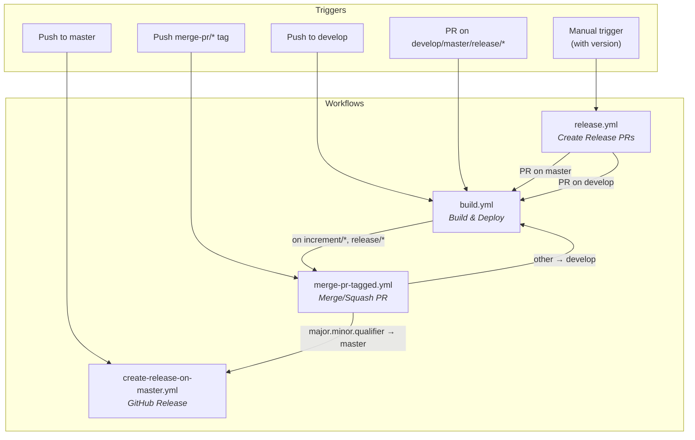
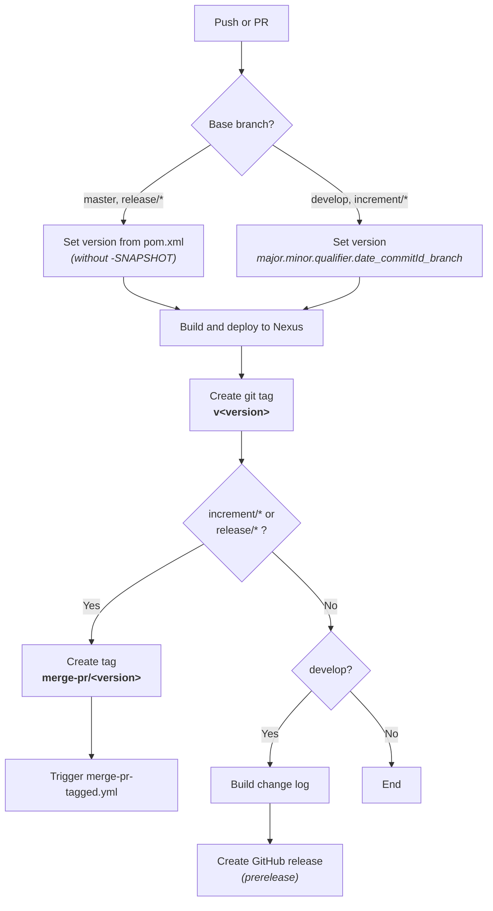
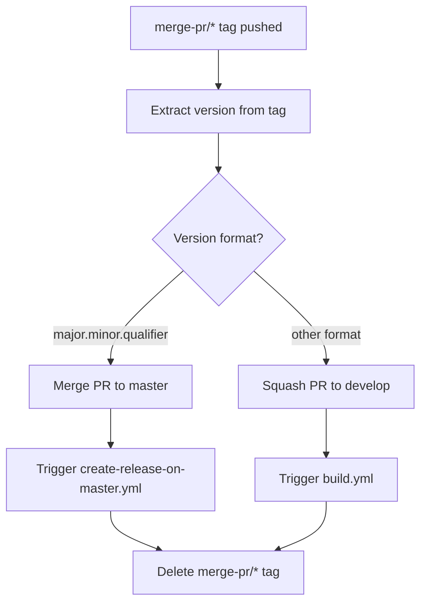
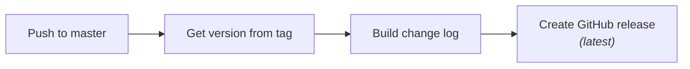
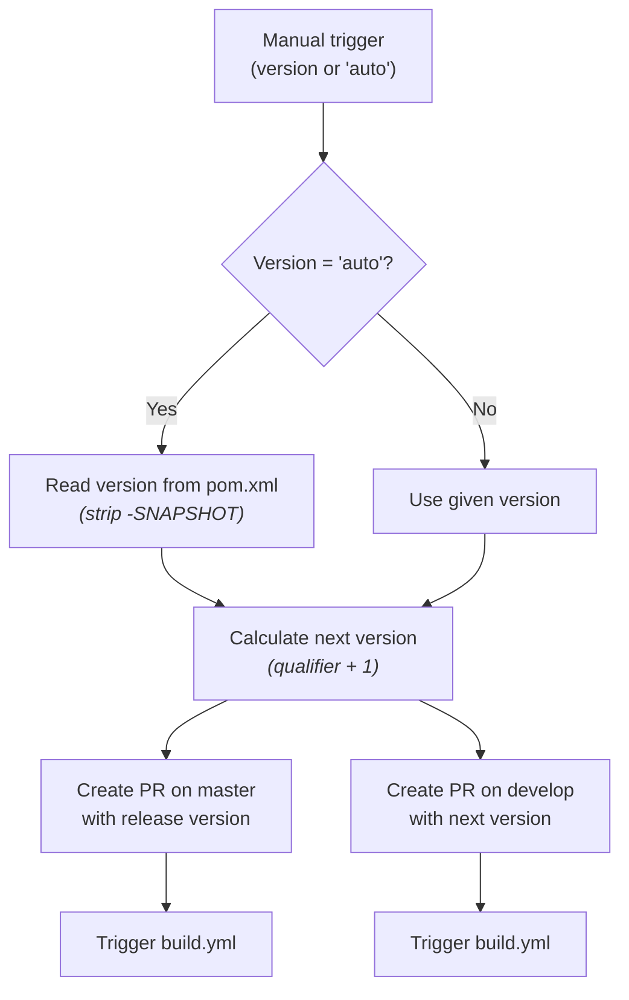

# Development Version and Branch Handling

This document describes the branching strategy, version numbering, and CI/CD workflows used in judo-meta-keycloak. The project follows a [GitFlow](https://www.atlassian.com/git/tutorials/comparing-workflows/gitflow-workflow)-based model with automated GitHub Actions pipelines.

## Branches

The repository maintains several branch types, each serving a specific role in the development lifecycle:

```mermaid
gitGraph
    commit id: "initial"
    branch develop
    checkout develop
    commit id: "dev-1"
    branch feature/JNG-1
    commit id: "feat-1a"
    commit id: "feat-1b"
    checkout develop
    merge feature/JNG-1 id: "merge JNG-1"
    branch feature/JNG-2
    commit id: "feat-2a"
    checkout develop
    merge feature/JNG-2 id: "merge JNG-2"
    branch release/1.0-beta1
    commit id: "rc-1"
    branch bugfix/JNG-4
    commit id: "fix-4"
    checkout release/1.0-beta1
    merge bugfix/JNG-4 id: "merge fix"
    checkout develop
    merge release/1.0-beta1 id: "merge release"
    checkout master
    merge release/1.0-beta1 id: "release 1.0"
```

| Branch Pattern | Base | Purpose |
|---------------|------|---------|
| `develop` | — | Active development. Contains the latest sources for the current active version. All feature branches merge here. |
| `feature/JNG-NUMBER_summary` | `develop` | New features for the current version. Named after the Jira ticket. |
| `(release/)X.Y-betaN` | `develop` | Release preparation branches. The `release/` prefix is reserved for CI. Created when a version is ready for stabilization. |
| `bugfix/JNG-NUMBER_summary` | release branch | Bug fixes found during release testing. Must be applied to both the release branch and newer development branches. |
| `support/JNG-NUMBER_summary` | release branch | Minor enhancements for a previous release. Merged back to the release branch when the update ships. |
| `master` | — | Latest released sources. Only receives merges from release branches. |
| `hotfix/JNG-NUMBER_summary` | `master` | Urgent fixes applied to both `master` and `develop`. |

## Version Numbers

Version numbers follow semantic versioning with specific rules for each branch type:

| Action | Version Change | Example |
|--------|---------------|---------|
| Start a feature branch | No change | — |
| Start a release branch from develop | Increment 2nd number on `develop` | `1.1.0-SNAPSHOT` → `1.2.0-SNAPSHOT` |
| Bugfix on a release branch | No change | — |
| Start a support branch | Increment 3rd number | `1.1.0` → `1.1.1` |
| Start a hotfix branch | Increment 4th number | `1.1.0` → `1.1.0.1` |

> **Note:** CI builds append branch and commit metadata to the version. For example, version `1.0.1-SNAPSHOT` on the `develop` branch at commit 40 becomes `1.0.1.develop_40`.

## GitHub Actions Workflows

The CI/CD pipeline is composed of four interconnected workflows that automate building, merging, releasing, and version management:



### build.yml

Triggered on pushes to `develop` and pull requests targeting `develop`, `master`, `increment/*`, or `release/*` branches.



### merge-pr-tagged.yml

Triggered when a `merge-pr/*` tag is pushed. Determines whether to merge to `master` (for release versions) or squash to `develop` (for development versions).



### create-release-on-master.yml

Triggered on pushes to `master`. Creates a GitHub release with a generated change log.



### release.yml

Manually triggered with a version parameter (or `auto` to use the pom.xml version). Creates two pull requests: one targeting `master` with the release version and one targeting `develop` with the incremented next version.



## Development Rules

> **Important:** There is no commit without a ticket number. Every commit and pull request must reference a Jira ticket in the format `JNG-xxx`.

Issue tracking: [JIRA Dashboard](https://blackbelt.atlassian.net/jira/dashboards)
