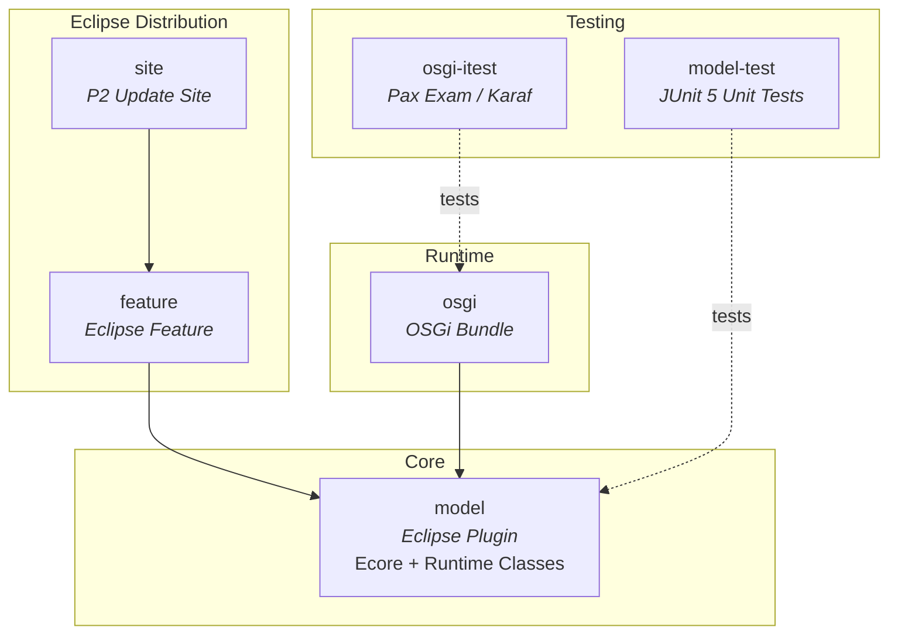
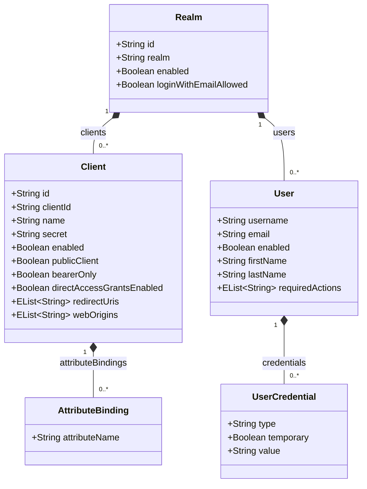
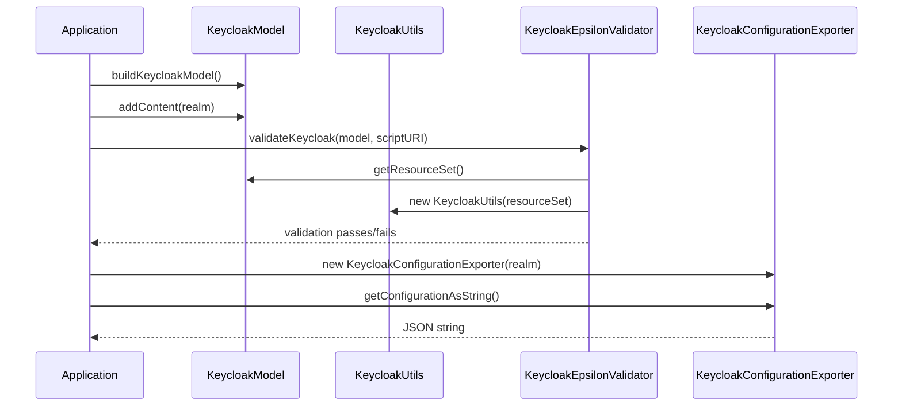
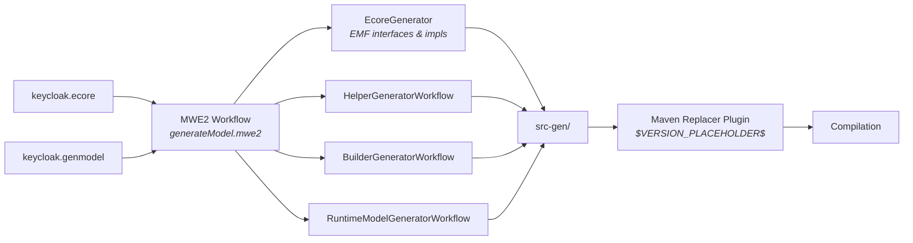
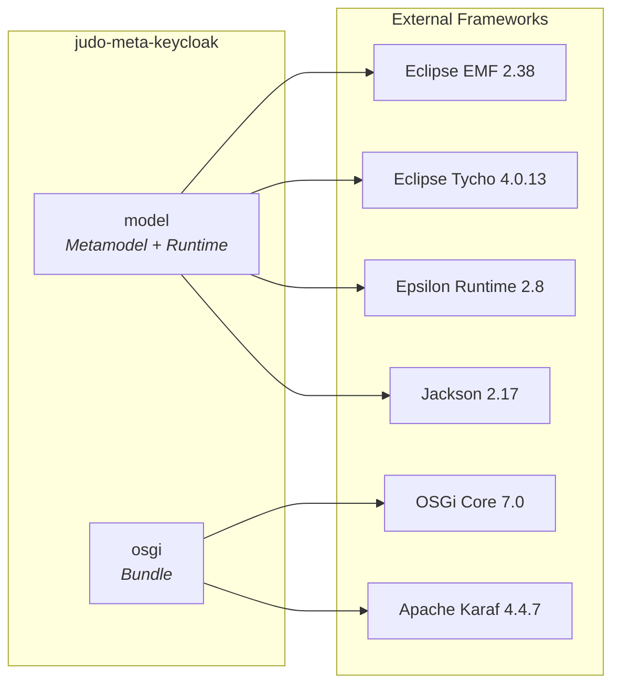

# judo-meta-keycloak

An Eclipse/EMF metamodel and runtime support library for Keycloak identity and access management (IAM) configuration, part of the [Judo framework](https://github.com/BlackBeltTechnology). It enables model-driven development of Keycloak realm configurations — defining realms, clients, users, credentials, and attribute bindings as structured Ecore model elements that can be validated, serialized to JSON, and deployed via OSGi.

The project works both as an **Eclipse plugin** (installable via P2 update site) and as a **standalone OSGi bundle** (deployable to Apache Karaf).

## Module Overview

The project is organized into six Maven modules that form a layered architecture:



| Module | Packaging | Purpose |
|--------|-----------|---------|
| `model` | `eclipse-plugin` (Tycho) | Ecore metamodel, EMF-generated code, hand-written runtime classes (validation, JSON export, Jackson mapping) |
| `model-test` | `jar` | JUnit 5 unit tests for model utilities, validation, and export |
| `osgi` | `bundle` (Felix) | Repackages model as standalone OSGi bundle with embedded Epsilon validation rules and a `BundleTracker` for automatic model discovery |
| `osgi-itest` | `jar` | OSGi integration tests using Pax Exam on Apache Karaf 4.4.7 |
| `feature` | `eclipse-feature` | Eclipse feature definition for IDE installation |
| `site` | `eclipse-repository` | Eclipse P2 update site for "Install New Software" |

## Keycloak Metamodel

The Ecore metamodel (`model/model/keycloak.ecore`) defines five entity types that model a Keycloak realm configuration:



All references are **containment** references — children are owned by their parent Realm/Client/User.

## Runtime Architecture

The hand-written runtime classes in `model/src/main/java/.../runtime/` provide model manipulation, validation, and export capabilities:



| Class | Responsibility |
|-------|---------------|
| `KeycloakModel` | Main model container with builder/loader pattern. Wraps an EMF `ResourceSet` and provides save/load operations. |
| `KeycloakUtils` | Stream-based query utilities — `all(Class<T>)` returns a `Stream<T>` of all model elements of a given type. |
| `KeycloakObjectMapper` | Configures Jackson for EMF `EList` deserialization using MixIn classes that add collection setters to generated `*Impl` classes. |
| `KeycloakEpsilonValidator` | Runs Epsilon EVL validation scripts against the model. Injects `KeycloakUtils` into the Epsilon execution context. |
| `KeycloakConfigurationExporter` | Converts a `Realm` to JSON via `TreeMap` intermediary. Only non-null attributes are included; output is alphabetically sorted. |

## Code Generation Pipeline

The build automatically generates EMF code from the metamodel:



> **Warning:** Never manually edit files in `src-gen/`. They are regenerated on every build and your changes will be lost.

To regenerate code in Eclipse IDE: right-click `model/src/workflow/generateModel.mwe2` → Run As → MWE2 Workflow. Requires XText, MWE2, and Epsilon plugins.

## Build & Development

### Prerequisites

- **Java 21** JDK
- **Maven 3.8.7+** (or use the included `./mvnw` wrapper)
- **BlackBelt Nexus credentials** in Maven `settings.xml` — see [Maven Settings](#maven-settings) below

### Build Commands

```bash
# Full build (code generation + compile + test)
./mvnw clean install

# Skip tests
./mvnw clean install -DskipTests

# Run a single test class
./mvnw test -pl model-test -Dtest=KeycloakConfigurationExporterTest

# Full verification including OSGi integration tests
./mvnw clean verify
```

### Maven Profiles

| Profile | Purpose |
|---------|---------|
| `modules` | Active by default. Includes all submodules. Disable with `-DskipModules=true` to run parent-only operations. |
| `sign-artifacts` | GPG-signs all artifacts. Requires GPG key configured in `settings.xml`. |
| `release-dummy` | Deploys artifacts to `/tmp` for local testing. |
| `release-judong` | Deploys to Judong Nexus repository. |
| `release-central` | Deploys to Maven Central via Sonatype OSSRH. |
| `update-target-versions` | Updates Eclipse target definition P2 repository URLs. Run with: `./mvnw clean install -P update-target-versions -f targetdefinition/pom.xml` |
| `update-category-versions` | Updates site category P2 repository URLs. Run with: `./mvnw clean install -P update-category-versions -f site/pom.xml` |
| `generate-github-asciidoc-diagrams` | Generates PlantUML diagrams from AsciiDoc documentation. |
| `update-source-code-license` | Updates EPL-2.0 license headers on all source files. |

### Maven Settings

This project references non-public BlackBelt artifacts. Configure your Maven `settings.xml`:

```xml
<servers>
    <server>
        <id>blackbelt-nexus-mirror</id>
        <username>${env.BLACKBELT_NEXUS_USERNAME}</username>
        <password>${env.BLACKBELT_NEXUS_PASSWORD}</password>
    </server>
</servers>

<mirrors>
    <mirror>
        <id>blackbelt-nexus-mirror</id>
        <name>blackbelt-nexus-mirror</name>
        <url>https://nexus.blackbelt.cloud/repository/maven</url>
        <mirrorOf>central</mirrorOf>
    </mirror>
</mirrors>
```

## Version Policy

Maven and Eclipse have different version conventions:

| Context | Format | Example |
|---------|--------|---------|
| Maven SNAPSHOT | `major.minor.patch-SNAPSHOT` | `1.0.1-SNAPSHOT` |
| Eclipse qualifier | `major.minor.patch.qualifier` | `1.0.1.qualifier` |
| CI build | `major.minor.patch.branch_commitNumber` | `1.0.1.develop_40` |

The **Flatten Maven Plugin** resolves CI-friendly `${revision}` properties, and the **Tycho Versions Plugin** converts between Maven and Eclipse version formats automatically during the build.

## Key Dependencies



## OSGi Model Discovery

In Karaf deployments, the `KeycloakModelBundleTracker` (OSGi Declarative Services component) automatically discovers and loads Keycloak models from bundles:

```mermaid
sequenceDiagram
    participant Bundle as OSGi Bundle
    participant Tracker as KeycloakModelBundleTracker
    participant Registry as OSGi Service Registry

    Note over Bundle: Bundle with header<br/>Keycloak-Models: name=northwind;file=model/...
    Bundle->>Tracker: Bundle arrives (ACTIVE)
    Tracker->>Tracker: KeycloakBundlePredicate.test()
    Tracker->>Tracker: loadKeycloakModel(bundleEntry)
    Tracker->>Registry: registerService(KeycloakModel.class, model)
    Note over Registry: Model available as OSGi service

    Bundle->>Tracker: Bundle removed
    Tracker->>Registry: unregister(service)
```

Bundles must include a `Keycloak-Models` manifest header specifying the model name and file path.

## Testing

- **Unit tests** (`model-test/`): JUnit 5, use builder pattern (`KeycloakBuilders.newRealmBuilder()`), annotated with `@Slf4j`
- **Integration tests** (`osgi-itest/`): Pax Exam with JUnit 4, test model loading and validation in a Karaf container
- Test naming: `*Test.java` for unit tests, `*ITest.java` for integration tests

## CI/CD

GitHub Actions workflows in `.github/workflows/` handle building, releasing, and versioning. See [CIFLOW.md](.github/CIFLOW.md) for the detailed branching and CI workflow documentation.

## Eclipse IDE Installation

The P2 update site is published with each GitHub release. To install:

1. In Eclipse: **Help → Install New Software**
2. Add the URL from the [GitHub releases page](https://github.com/BlackBeltTechnology/judo-meta-keycloak/releases), or point to an uncompressed site ZIP
3. Select the Keycloak metamodel feature and install

Requires the m2e, Epsilon, and Modeling Tools plugins (or use the prebuilt Judo Eclipse package).

## Troubleshooting

**JUnit in Eclipse:** Tycho's classpath doesn't include JUnit by default. A `Required-Bundle` entry is added to the MANIFEST as a workaround ([Eclipse bug 534587](https://bugs.eclipse.org/bugs/show_bug.cgi?id=534587)).

**Lombok:** Tycho does not support Lombok code generation ([lombok#285](https://github.com/rzwitserloot/lombok/issues/285)). Lombok is only used in non-Eclipse modules.

**Tycho surefire `argLine`:** The `argLine` configuration in the parent `pom.xml` (tycho-surefire-plugin) must not be broken by auto-formatting — it must remain on a single line.
